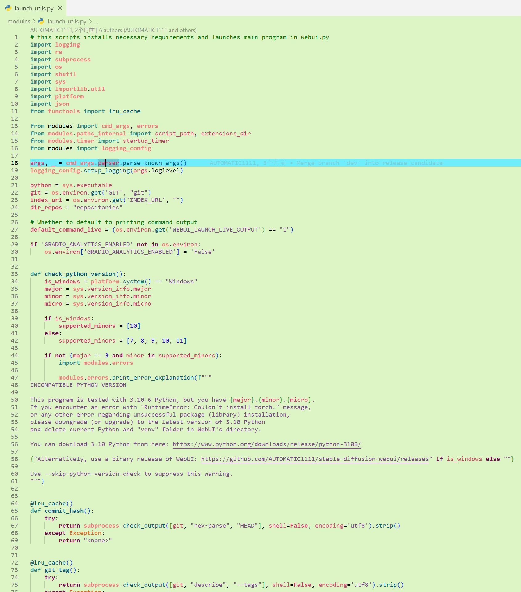

# 基于Processing IDE的魔改版语法高亮主题插件

[中文](#简介) | [English](#introduction)

## 简介

[Processing](https://processing.org/)是一个用于图形设计的编程语言，本插件在其中的IDE的默认语法高亮（语法着色）的基础上添加了其他一部分高亮规则，使得类变量接口字符串数字等内容可以更容易的被人眼分辨出来，这样程序员在学习新的语言时可以通过代码的颜色判断其含义，从而更清晰的理解新语言，以下是具体规则：

**此表格并不完善，可能有很多错误，之后将会修正。**

| 代码文本类型                         | 颜色                                 | 样式     |
| ------------------------------------ | ------------------------------------ | -------- |
| 关键字，修饰符，控制结构，常量等     | $\color[RGB]{36,136,136}■$`#248888`  | 不好解释 |
| 注释                                 | $\color[RGB]{0,128,0}■$`#008000`     | 无       |
| 数字常量                             | $\color[RGB]{42,0,236}■$`#2A00EC`    | 无       |
| 变量名、实体名                       | $\color[RGB]{213,53,105}■$`#D53569`  | 无       |
| 参数                                 | $\color[RGB]{229,69,121}■$`#E54579`  | 无       |
| 字符串                               | $\color[RGB]{127,71,148}■$`#7F4794`  | 无       |
| 函数名                               | $\color[RGB]{0,89,132}■$`#005984`    | 无       |
| 括号、分隔符、通配符                 | $\color[RGB]{0,0,0}■$`#000000`       | 无       |
| 注解、泛型通配符、角括号等           | $\color[RGB]{223,223,223}■$`#dfdfdf` | 无       |
| 类型标识符，继承类，标签，属性名称等 | $\color[RGB]{251,97,4}■$`#FB6104`    | 无       |

安装开发工具：`npm install -g @vscode/vsce`

打包：`vsce package`

## introduction

[Processing](https://processing.org/) is a programming language used for graphic design. **This plugin** adds many other highlighting rules to the default syntax highlighting (syntax coloring) of the Processing IDE, making it easier for human eyes to distinguish content such as class variable interfaces, strings, and numbers. This way, programmers can judge the meaning of the code through its color when learning a new language, thereby gaining a better understanding of the new language. The following are specific rules:

**This table is not complete and may contain many errors, which will be corrected later.**

| Code Text Type                                       | Color                                | Style           |
| ---------------------------------------------------- | ------------------------------------ | --------------- |
| Keywords, modifiers, controls, constants             | $\color[RGB]{36,136,136}■$`#248888`  | hard to explain |
| Comment                                              | $\color[RGB]{0,128,0}■$`#008000`     | none            |
| Numeric constant                                     | $\color[RGB]{42,0,236}■$`#2A00EC`    | none            |
| Variable and entity name                             | $\color[RGB]{213,53,105}■$`#D53569`  | none            |
| Parameter                                            | $\color[RGB]{229,69,121}■$`#E54579`  | none            |
| String                                               | $\color[RGB]{127,71,148}■$`#7F4794`  | none            |
| Function name                                        | $\color[RGB]{0,89,132}■$`#005984`    | none            |
| Brackets, separators, wildcard                       | $\color[RGB]{0,0,0}■$`#000000`       | none            |
| Annotations, generics, angle brackets                | $\color[RGB]{223,223,223}■$`#dfdfdf` | none            |
| Type identifier, inherited class, tag, property name | $\color[RGB]{251,97,4}■$`#FB6104`    | none            |

install development tool: `npm install -g @vscode/vsce`

package: `vsce package`
